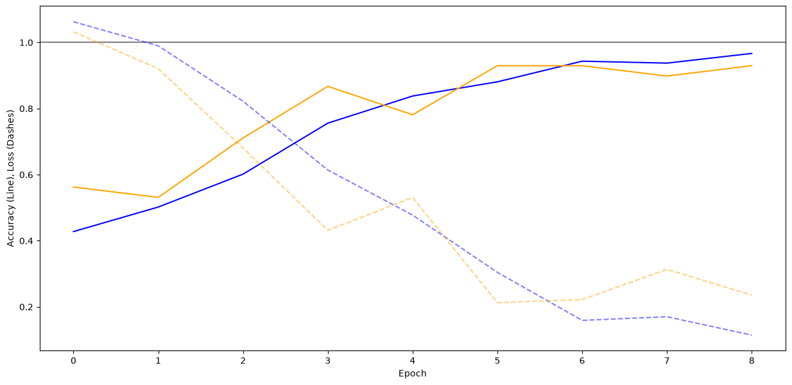
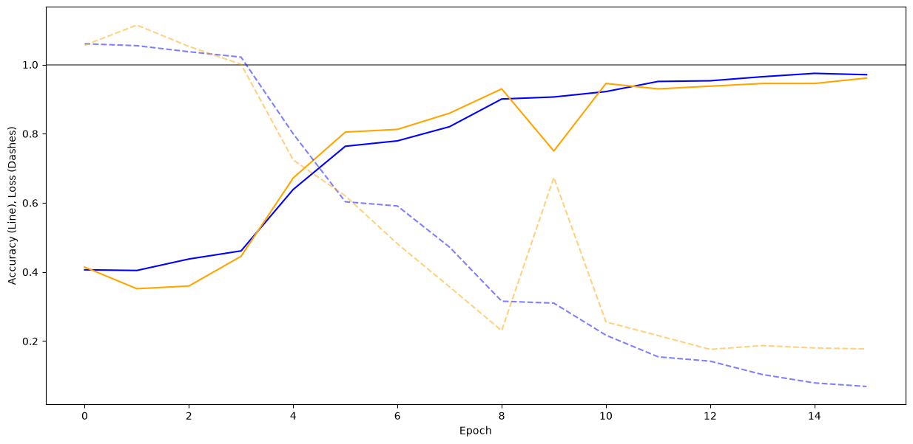
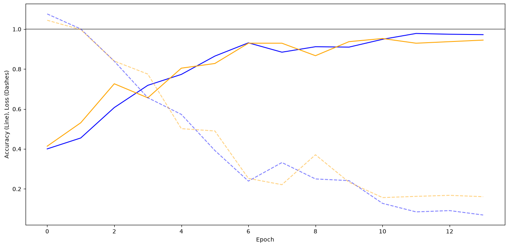
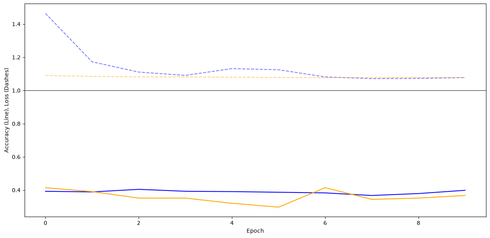

# Exploring Hyperparameters
## Explanation
Data augmentation means to adding tweaked versions of the training set data to the same set to increase the training data set size artaficialy.

## Approach
The test consist of different levels of data augmentation beeing used:
- **Base** (No data augmentation)
- **Light data augmentation** (Only ``RandomFlip('horizontal')``)
- **Medium data augmentation** (Default: Light + ``RandomContrast(0.1)``)
- **High data augmentation** (All: Medium + ``RandomBrightness(0.1)``+``RandomRotation(0.2)``)
All tests will be done in the folder test.

## Assumptions
I expect that having no augmentation at all causes the model to overfit because there is not enough variation in the default data set. Adding augmentation should improve the accuracy because it generalizes the model better for different settings like different lighting or hand positions. At the same time, I expect the training to take longer with each augmentation level, but the prediction time to stay roughly the same.
Overall I initially assumed that more augmentation would only improve the final result.

## Findings
Up to the **medium** level my initial assumptions hold partialy true.
With Data augmentation more epochs are needed for the training. Suprisingly the **low** level needs two epochs less but still six more than the **base**. The accuracy improves or stays roughly the same by using more data augmentation levels until the **medium** level. Futhermore there are more spikes in the errors for the training with data augmentation what makes sense considering that it is harder for the model to make out features due to the differing tweaked data.

However the **high** data augmentation shows a completely different picture. Here the training accuracy stays at roughly 40%. Therefore my initial assumption must be corrected. **Too much augmentation can prevent the model from finding common features, because the immages just look to different causing the training to fail completly.**

### Result:
A **light** to **medium** amount of data augmentation can improve the base model. However using to much augmentation like in the **high** level here makes the training fail entirely.

## Visualization
### No data augmentation:

### Light data augmentation:

### Medium data augmentation:

### High data augmentation:

